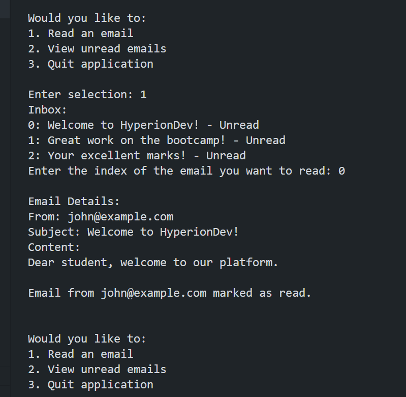

# Email Simulator

## Description
This app is an email simulator using OOP and offers these features:
● Created an Email class and initialised a constructor that takes in three
arguments:
○ email_address - the email address of the sender.
○ subject_line - the subject line of the email.
○ email_content - the contents of the email.
● Inside the constructor, initialised the following instance variables:
○ email_address
○ subject_line
○ email_content
○ has_been_read (initialised to `False`).
● The Email class contains the following instance method
to edit the values of the email objects:
○ Implemented an instance method called mark_as_read() that sets the
has_been_read instance variable to `True`.
● Initialised an empty variable called inbox of type list to store, and access, the
email objects.
● Created the following functions to add functionality to my email simulator:
○ populate_inbox() - a function that creates an email object with the
email address, subject line, and contents, and stores it in the inbox
list.
Note: At program start-up, this function should be used to populate your inbox
with three sample email objects for further use in your program. This function
does not need to be included as a menu option for the user.
○ list_emails() - a function that loops through the inbox and prints
each email’s subject_line, and a corresponding number. For
example, if there are three emails in the Inbox:
0 Welcome to HyperionDev!
1 Great work on the bootcamp!
2 Your excellent marks!
This function can be used to list the messages when the user
chooses to read, mark them as spam, and delete an email.
Tip: Use the enumerate() function for this.
○ read_email() - a function that displays a selected email, together
with the email_address, subject_line, and email_content, and then
sets its has_been_read instance variable to True.
For this, allow the user to input an index, such that read_email(i)
prints the email stored at position i in the list. Following the example
above, an index of 0 will print the email with the subject line
“Welcome to HyperionDev!”.
● I built out the class, methods, lists, and functions to get
everything working:

When the user chooses to:
1. Read an email
2. View unread emails
3. Quit application

## Table of Contents
- [Email Simulator](#email-simulator)
  - [Description](#description)
  - [Table of Contents](#table-of-contents)
  - [Installation](#installation)
  - [Usage](#usage)
  - [License](#license)
  - [Contributing](#contributing)
  - [Credits](#credits)
  - [Tests](#tests)
  - [Questions](#questions)

## Installation
How to install Python in terminal?
Step 1: Download the Python installer. Visit the official Python website and download the latest version of Python 3.x for Windows. ...
Step 2: Run the Installer. ...
Step 3: Customize the Installation (Optional) ...
Step 4: Install Python. ...
Step 5: Verify the installation.

How to add pip to path Python?
How to Add Python Pip to Path
Locate pip Installation:
Modify the PATH Environment Variable for this session:
Modify the PATH Environment Variable permanently:
Verify the Modification:
Locate pip Installation:
Modify the PATH Environment Variable:
Add the Path to the Environment Variables:
Verify the Modification:

## Usage

A screenshot of the user input is shown here:

A screenshot of the printout is shown here:

The repository can be accessed using this link:https://github.com/Mikemupararano/email-simulator.

## License
This application is covered under the MIT license.

## Contributing
 N/A

## Credits
N/A
## Tests
N/A

## Questions
For any questions or concerns, please contact me at [kudath@yahoo.co.uk](mailto:kudath@yahoo.co.uk).
You can also find me on GitHub: [https://github.com/Mikemupararano](https://github.com/https://github.com/Mikemupararano)
